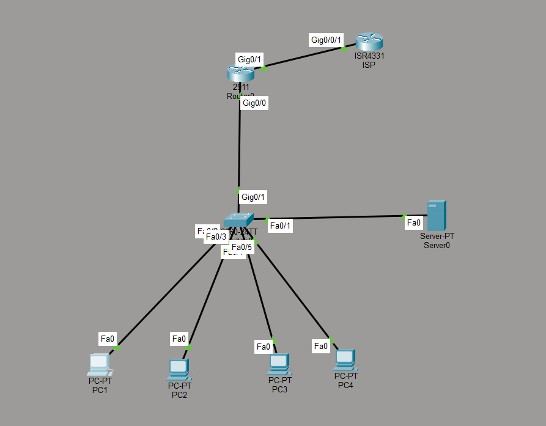

# Coffee Shop Network Design

## 📋 Project Overview

Designed and implemented a secure, segmented network for a small business (coffee shop) with multiple user types and security requirements. This project demonstrates practical application of CCNA concepts in a real-world scenario.

## 🎯 Business Requirements

**Bean There Coffee Shop** needed a network solution that would:
- Support 20+ employee devices (POS systems, office computers, printers)
- Provide separate guest WiFi for customers
- Isolate security cameras on their own network segment
- Support VoIP phones for business communications
- Prevent guests from accessing internal business resources
- Provide internet connectivity for all devices

## 🏗️ Network Architecture

### Topology

### Devices
- **1x Core Router** - Inter-VLAN routing, DHCP, NAT, security policies
- **1x Access Switch** - VLAN assignment, port security, access layer
- **1x ISP Router** - Simulated internet connectivity
- **Multiple End Devices** - PCs, cameras, phones across different VLANs

### IP Addressing Scheme

| VLAN ID | VLAN Name | Network | Gateway | Purpose |
|---------|-----------|---------|---------|---------|
| 10 | EMPLOYEE | 192.168.10.0/24 | 192.168.10.1 | Office computers, POS, printers |
| 20 | GUEST | 192.168.20.0/24 | 192.168.20.1 | Customer WiFi |
| 30 | IOT | 192.168.30.0/24 | 192.168.30.1 | Security cameras, IoT devices |
| 40 | VOICE | 192.168.40.0/24 | 192.168.40.1 | VoIP phones |

**WAN Connection:** 203.0.113.0/30 (Router to ISP)

## 🔧 Technologies Implemented

### VLANs & Inter-VLAN Routing
- **4 VLANs** for network segmentation by device type/user role
- **Router-on-a-Stick** configuration (802.1Q trunking)
- Subinterfaces on router for each VLAN gateway

### DHCP
- **4 separate DHCP pools** (one per VLAN)
- Reserved address ranges (.1-.10) for static assignments
- Automatic IP assignment for all end devices

### Network Address Translation (NAT)
- **PAT (Port Address Translation)** - overload configuration
- All internal networks share single public IP (203.0.113.2)
- Access-list defining inside networks for translation

### Access Control Lists (ACLs)
- **Guest Isolation ACL** - Prevents guest VLAN from accessing internal VLANs
- **IoT Security ACL** - Blocks IoT devices from employee network
- Extended ACLs applied inbound on VLAN interfaces

### Switch Security
- **Port Security** on employee ports (max 2 MAC addresses)
- **Sticky MAC learning** enabled
- **PortFast** on access ports for faster STP convergence

## 🧪 Testing & Verification

### Successful Tests
✅ All devices received correct DHCP addresses for their VLAN  
✅ Devices within same VLAN can communicate  
✅ Devices in different VLANs can communicate (inter-VLAN routing working)  
✅ Guest VLAN **blocked** from accessing Employee VLAN (ACL working)  
✅ Guest VLAN **blocked** from accessing IoT VLAN (ACL working)  
✅ IoT VLAN **blocked** from accessing Employee VLAN (ACL working)  
✅ All VLANs can reach internet (NAT working)  
✅ Port security prevents unauthorized MAC addresses on employee ports  

### Verification Evidence
Screenshots of all verification commands available in `/verification` folder:
- DHCP bindings showing automatic assignments
- Ping tests demonstrating connectivity and ACL enforcement
- NAT translations showing address conversion
- Port security status

## 🚧 Challenges & Solutions

### Challenge 1: Guest devices could initially ping employee network
**Root Cause:** No access control between VLANs  
**Solution:** Implemented extended ACL on Guest VLAN interface denying traffic to RFC1918 private addresses (employee, IoT, voice networks) while permitting internet access

### Challenge 2: Initial internet connectivity issues
**Root Cause:** Missing ISP router configuration in lab environment  
**Solution:** Configured dedicated ISP router (203.0.113.1) with proper routing back to internal networks, verified end-to-end connectivity

### Challenge 3: Port security triggering violations during testing
**Root Cause:** Strict MAC address limits during lab testing  
**Solution:** Adjusted violation mode to `restrict` (logs but doesn't shutdown port) for lab environment; would use `shutdown` in production

## 📂 Repository Contents

- **`/configs`** - Complete running configurations for all devices
- **`/topology`** - Network diagram
- **`/verification`** - Screenshots of verification commands and outputs
- **`/packet-tracer`** - Packet Tracer file (.pkt) for hands-on review

## 🛠️ Tools Used

- **Cisco Packet Tracer** - Network simulation and testing
- **Cisco IOS** - Router and switch configuration

## 💡 Key Takeaways

1. **VLAN segmentation** is critical for security - different user types should never share the same broadcast domain
2. **ACLs must be specific** - Block what you don't want, permit what you need, in that order
3. **Documentation is as important as configuration** - Network changes without documentation create operational risk
4. **Testing validates design** - Always verify security policies work as intended with real traffic tests

## 🎓 Skills Demonstrated

- Network design based on business requirements
- VLAN planning and implementation
- Inter-VLAN routing (Router-on-a-Stick)
- DHCP server configuration
- NAT/PAT configuration
- Extended ACL design and implementation
- Switch port security
- Systematic troubleshooting methodology
- Technical documentation

## 📞 Contact

**Edmund Igweonu**  
Email: stigedmunds@gmail.com  
LinkedIn: linkedin.com/in/edmund-igweonu-a626b6155
Location: St. John's, NL (Relocating to Calgary, AB in August 2026)

---

*This project was completed as part of hands-on CCNA lab experience. All configurations are available for review and the Packet Tracer file can be opened to test functionality.*